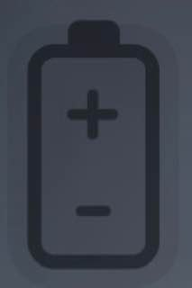
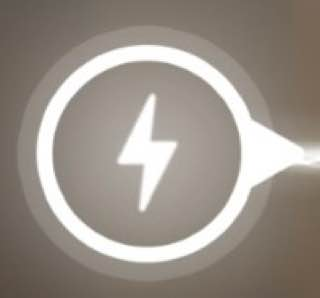
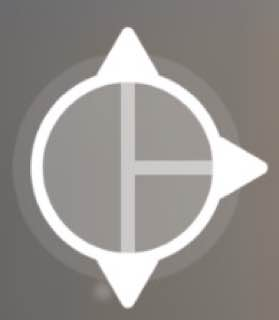

# Сценарий игры

## Описание

При первом запуске пользователь попадает на страницу игры, запускается первый уровень. Он знакомится с целевыми элементами и правилами нашей игры:
- элемент источник энергии (`молния`);
- элемент приемник энергии (`батарейка`).

Игрок может взаимодействовать с любым подсвеченным элементом (*кликать по нему*). Это позволяет поворачивать элемент по часовой стрелке. Игрока обучают, что от молнии исходит луч и его нужно направить в батарейку. Координаты элементов предустановлены для каждого уровня.

Находясь на уровне, пользователю всегда доступны 2 кнопки и копилка с суммой монет (*до 3 уровня значение равно 0*):
- кнопка перезапуск уровня;
- кнопка, вызывающая экран с правилами игры.

Внизу экрана расположено меню, где пользователь может выбирать экраны:
- рейтинг с другими игроками (*страница лидерборд*);
- профиль пользователя (*страница редактирование пользователя*);
- основной экран (*страница игры*).

## Цель
Цель игры направить луч (*зарядить*) от источника энергии (`молнии`) до приемника энергии (`батарейки`). При прохождении уровня, повышается сложность и игрока знакомят с новыми элементами:
- элемент отражающий энергию(`треугольник`);
- элемент рассеивающую энергию(`проводник с тремя сторонами`).

## Рейтинг
Начиная с третьего уровня, на поле появляется элемент звезда (`множитель баллов`). Этот элемент является бонусным, не влияет на прохождения уровня. На игровом поле может быть расположено от 1 до 3-х звезд, если игрок может направить луч через зведу, он получает +5 монет. За уровень игрок может получить от 0 до +15 монет. После прохожения уровня, монеты суммируются в копилку и доступны для просмотра на основном экране. Монеты влияют на рейтинг между игроками.

Примеры элементов:

|Элемент|Описание|
| :------------------------------: | :------------------------------------------------------------------------------------------------------------------------------------------------------ |
|  | Элемент источник энергии (`молния`) - принимает луч *(этот элемент не взаимодействует с пользователем)* |
|  | Элемент приемник энергии (`батарейка`) - испускает луч |
|  | Элемент отражающий энергию(`треугольник`) - направляет луч |
|  | Элемент рассеивающую энергию(`проводник с тремя сторонами`) - рассеивает луч в 3 стороны |
|  | Элемент звезда (`множитель баллов`) - бонусный элемент *(этот элемент не взаимодействует с пользователем)* |

